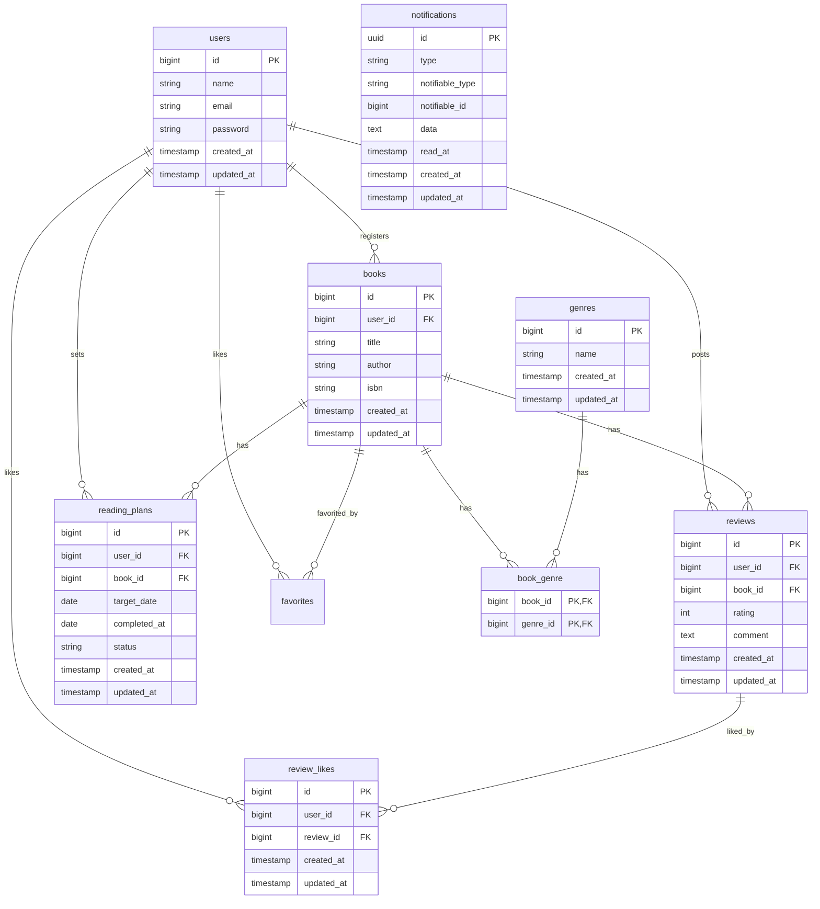

# BookShelf 書籍レビューアプリ
書籍、ジャンルの登録、管理から、読書のリアルなレビュー、読書計画の進捗管理、個人の読書統計を可視化し、ランキング・公開 API を備えた Laravel アプリケーションです。

## 開発者
- 中村蒼奈

## 動作環境
- Docker / Docker Compose（Laravel Sail）
- PHP 8.5.8 / Laravel 10.50.2 / MySQL 8.4.10
※ Windows をお使いの場合は WSL2 の利用を推奨します。Apple Silicon の Mac でプラットフォームエラーが出る場合は、`compose.yaml` の該当サービスに `platform: linux/amd64` を追記してください。

## 環境構築手順
1. リポジトリのクローンとディレクトリ移動

```bash
git clone git@github.com:ainasan0321/bookshelf-app.git
cd bookshelf-app
```

2. `.env` を用意する

```bash
cp .env.example .env
```

3. 依存パッケージをインストールする（初回は `vendor` がないため Docker 経由で実行）

```bash
docker run --rm \
    -u "$(id -u):$(id -g)" \
    -v "\$(pwd):/var/www/html" \
    -w /var/www/html \
    laravelsail/php82-composer:latest \
    composer install --ignore-platform-reqs
```

4. Dockerコンテナの起動

```bash
./vendor/bin/sail up -d
```

5. アプリケーションキーの生成

```bash
./vendor/bin/sail artisan key:generate
```

6. マイグレーションと初期データの投入

```bash
./vendor/bin/sail artisan migrate:fresh --seed
```

7. フロントエンドをビルド

```bash
./vendor/bin/sail npm install
./vendor/bin/sail npm run dev
```

8. ブラウザで http://localhost にアクセスする

## 開発環境 URL
- アプリケーション: http://localhost
- phpMyAdmin: http://localhost:8080

## テストの実行
テストカバレッジ82.1%を達成しています。

```bash
./vendor/bin/sail artisan test
./vendor/bin/sail artisan test --coverage --min=60
```

### バッチ処理の即時検証コマンド（手動実行）
期限3日前・当日のリマインダー通知、および期限切れ計画の自動失効バッチを即時検証したい場合は、以下のコマンドを実行します。
```bash
./vendor/bin/sail artisan app:reading-plan-alert-command
```

## 公開 API エンドポイント
| メソッド | パス | 概要 | 認証 (Sanctum) |
|----------|------|------|------------|
| GET | `/api/v1/books` | 書籍一覧（検索・フィルタ・ソート・ページネーション） | 不要 |
| GET | `/api/v1/books/{id}` | 書籍詳細 | 不要 |
| POST | `/api/v1/books` | 書籍登録 | 必須 |
| PUT | `/api/v1/books/{id}` | 書籍更新 | 必須 |
| DELETE | `/api/v1/books/{id}` | 書籍削除 | 必須 |

## 機能一覧

### 基本機能
- ユーザー認証
- 書籍のCRUD
- ジャンルのCRUD
- レビューのCRUD
- お気に入り機能
- レビューへのいいね機能
- ランキング機能
- 公開API

### 応用機能
- 高度な検索・絞り込み・ソート
- マイ読書レポート
- 読書計画
- リマインダー通知

## 使用技術
- PHP 8.5.8 / Laravel 10.50.2
- MySQL 8.4.10
- Docker / Laravel Sail
- Laravel Fortify
- Tailwind CSS / Vite
- Laravel Sanctum
- PHPUnit

## ER 図



## 未実装
ISBN検索